<div align="center">




<br/>

[](https://www.linkedin.com/in/kartik-sharma-946443332)
[](https://github.com/Kartikshard)


</div>


## ◾ About

```python
class KartikSharma:
    role      = "Data Science & ML Enthusiast"
    focus     = ["Predictive Modeling", "Customer Analytics", "Time-Series Forecasting"]
    building  = "End-to-end ML projects from EDA to insight"
    currently = "Sharpening my modeling + deployment skills"
    reach_me  = "linkedin.com/in/kartik-sharma-946443332"
```


## ◾ Tech Stack

<div align="center">


</div>


## ◾ Featured Projects

<div align="center">

<a href="https://github.com/Kartikshard/customer-churn-prediction"></a>
<a href="https://github.com/Kartikshard/flowscrape"></a>
<a href="https://github.com/Kartikshard/Bank-Marketing"></a>
<a href="https://github.com/Kartikshard/Electricity-consumption-prediction"></a>
<a href="https://github.com/Kartikshard/Whole-Sale-Customer-Segmentation"></a>

</div>


## ◾ GitHub Analytics

<div align="center">


</div>


